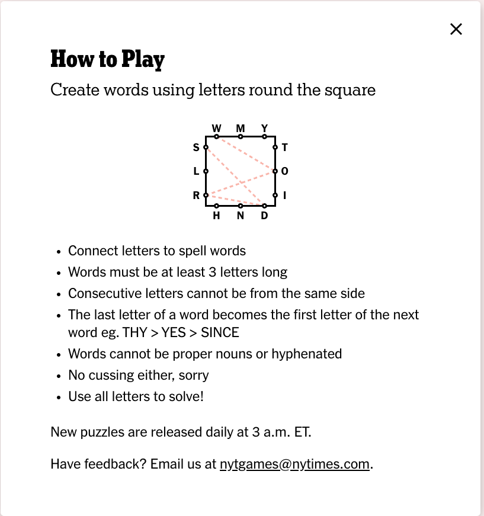

# letterboxsolver

Solves NYT letterbox game, using a dictionary of your choice.

# The Game

All credit to NYT and Sam Ezersky for creating this game as I know it. Check out the game yourself [here!](https://www.nytimes.com/puzzles/letter-boxed)




# The Solver

## Overview of Algorithm
The solver is optimizing a set of sequential decisions - an ideal use case for dynamic programming (DP).

More details on abstracting as a DP problem:
- The player chooses a sequence of words to attempt to cover all possible letters.
- A "terminating" sequence is a sequence of words that covers all of the presented letters in the game.

An optimal solution is a terminating sequence that minimizes the total number of words used.

### Determining Valid Words
A letterbox problem allows you to construct any word using the letters presented, as long as no consecutive letters are on the same side of the letter box.

Moreover, subsequent words must begin with the last letter of the previous word.

A letterbox problem thus is actually a set of valid edges between any two characters in the english alphabet. These edges stay static throughout the course of a game.


### Solution Search and Termination
The algorithm searches all possible policies of m-words/decisions. This is considered an m-word state.

We choose to "breadth first" search all possible m-word states.

Each state has a set of letters remaining. A state is considered terminating if there are no letters remaining to cover. The m'th stage (all possible m-word states) is considered terminating if it contains at least one m-word state.

Once we hit a terminating stage, the program terminates and prints out the first terminating state within that stage.

TODO(tamjid): set max stages

### Optimizations

#### Pruning between stages
Two states are equally cost-efficient if they use the same number of words to achieve the same set of letters remaining, and the last word ends with the same letter.

If we do not care for populating all possible solutions, a sequence of words that covers fewer letters than another sequence in the same stage may be removed from consideration.

## The Code
I chose Rust as a way to learn this language! Code Reviews welcome.

### Getting Started

1. ```cargo run```
2. Follow the prompts!

```
➜  letterboxsolver git:(main) ✗ cargo run
    Finished dev [unoptimized + debuginfo] target(s) in 0.01s
     Running `target/debug/letterboxsolver`
-------Loading dictionary from words.txt complete!-------
Enter letters on side 1. (e.g.: xyz) :jli
Enter letters on side 2. (e.g.: xyz) :cud
Enter letters on side 3. (e.g.: xyz) :btk
Enter letters on side 4. (e.g.: xyz) :asr


Solving [['j', 'l', 'i'], ['c', 'u', 'd'], ['b', 't', 'k'], ['a', 's', 'r']]
Solution: ["disturb", "blackjack"]
```